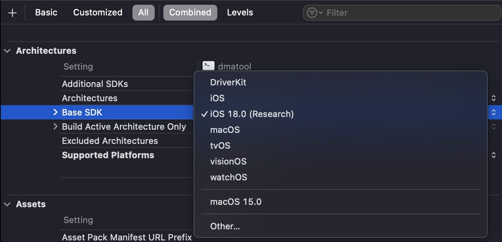

> Disclaimer: this project is provided for use within the [Apple Security Research Device Program](https://security.apple.com/research-device/), use for any purpose outside of security research is outside the scope of the project, please don't report issues or request features that are not within that scope.

# Research SDK

This repository provides a `researchsdk` script that can be used to generate a "Research" variant of the iOS SDK for use with [SRD](https://security.apple.com/research-device/) development.

## Xcode 16.3 And Later Notice

The identifier used by the generated SDKs is no longer recognized as of Xcode 16.3 beta 1, resulting in an `unable to find sdk` error message.

To work around that, change the `SDKROOT` build setting to the full path of the research SDK, for example:

```
SDKROOT = /Applications/Xcode-beta.app/Contents/Developer/Platforms/iPhoneOS.platform/Developer/SDKs/iPhoneOS18.4.internal.sdk
```

The script will print out the path after running, and you can obtain the path at any time by running:

```bash
xcrun --show-sdk-path --sdk iphoneos.internal
```

## Motivation

I like to use Xcode for all development, but when developing code to run on the Security Research Device, it can be difficult to do all development within Xcode, since it requires adhoc signing and frequent use of SPI or API that's marked unavailable for the iOS SDK.

This tool creates a new variant of the SDK with the following changes:

- Removes any `API_UNAVAILABLE(ios)` flags from headers
- Configures the SDK to allow adhoc signing of iOS binaries
- Allows signing executable iOS targets with arbitrary entitlements within Xcode

## Requirements

- Xcode 16
- jj (`brew install tidwall/jj/jj`)

## Generating the SDK

Just add the directory where you clone this repo to your `PATH` then run `researchsdk`. It will describe what it's about to do and ask for confirmation before proceeding.

The SDK will be generated for the Xcode version reported by `xcode-select -p`. If you need to switch the Xcode version, run `xcode-select -s /path/to/your/Xcode.app` before running the tool.

By default, the script will generate a research variant of the iOS SDK, but you may also include an argument with the name of another SDK to generate a research variant for that SDK instead (ex: `iphonesimulator`, `macosx`). I recommend doing that if you plan on running your binaries in the iOS Simulator or macOS for testing before deployment to the SRD.

## Using the SDK

After running `researchsdk`, be sure to restart Xcode if it's already running.

Create your iOS project in Xcode as usual, or using one of my [SRD Xcode templates](https://github.com/insidegui/srd-xcode-templates), then select "iOS XX.X (Research)" in the project build settings under "Base SDK".


